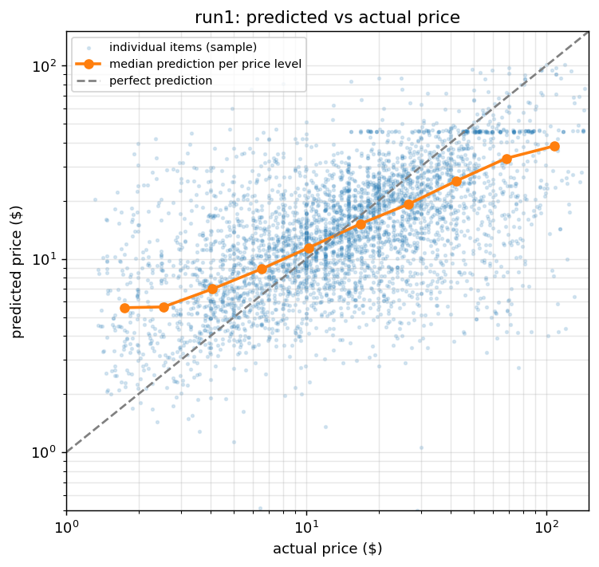
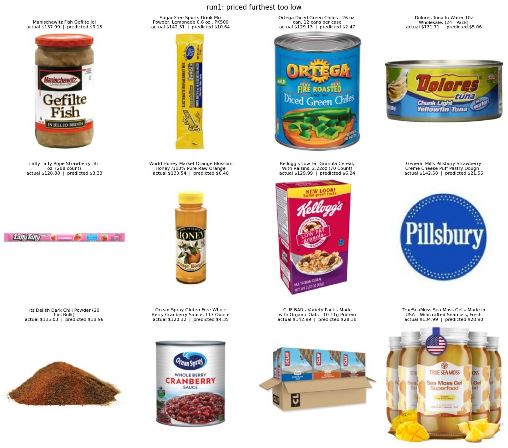
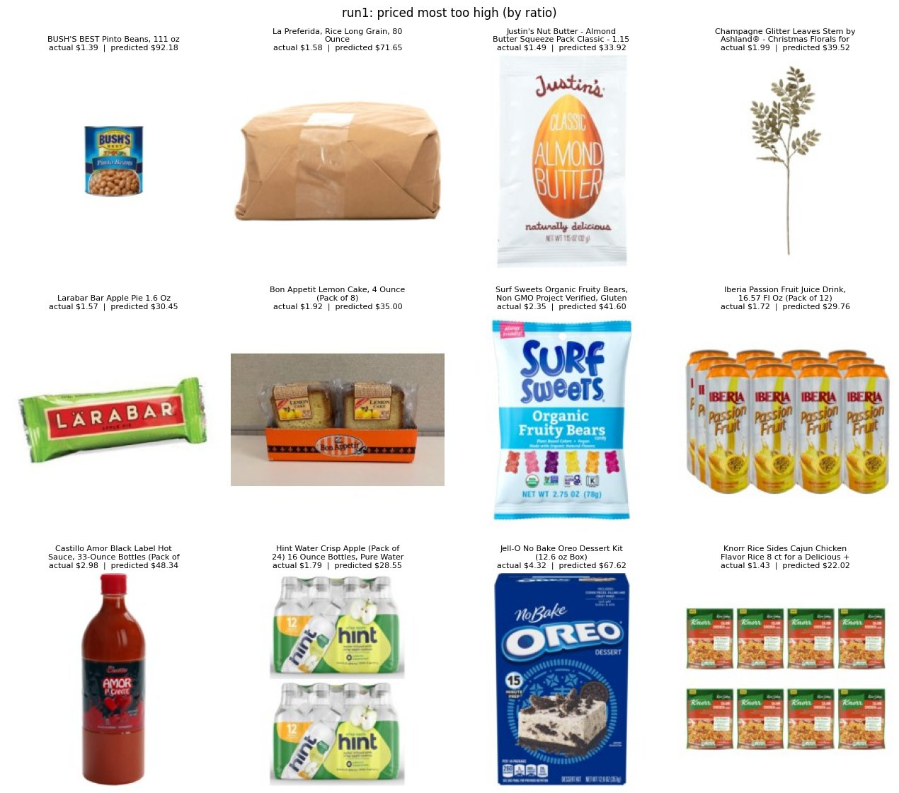

# Phase 3 — Evaluation, error analysis, export

The model chosen in Phase 2 is **run1** (`best.pt`, epoch 14, raw-price
target): val MAE $11.23, against $14.52 for always guessing the median price.
See [`experiments.md`](experiments.md) for how it was chosen.

Phase 3 runs in Kaggle Notebook C ([`notebooks/kaggle_phase3.ipynb`](../notebooks/kaggle_phase3.ipynb),
steps in the [Kaggle guide](kaggle_training_guide.md#notebook-c--phase-3-test-score-error-analysis-export-cpu)).

## Plan, written before the test run

*Left as written. Results go under "Results" below.*

**1. The test score.** run1 is scored once on the 11,028 test images, which
no run has been scored on. Validation was used for choosing (the epoch, and
run1 over run2), so the val numbers are slightly flattered by that choice;
the test number is the one to report. It comes with a 95% bootstrap interval
over images, and next to the median-price baseline on the same images. No
model gets changed or re-chosen because of it. If it disappoints, that goes
in the report as it is.

**2. Error analysis.**

- Predicted vs actual price across price levels, to see whether run1 pulls
  its guesses toward the middle, as run2's breakdown suggested.
- The 12 items priced furthest too low and the 12 priced most too high by
  ratio, with their photos, to name what goes wrong.
- **The pack-size check.** The working explanation is that much of what sets
  a price (pack size, quantity, brand) isn't visible in a photo. Pack size is
  testable: about a third of products mention a pack size ("Pack of 12",
  "6-Pack"; 3,582 of the test images), and the photo often shows one unit. The check compares multipacks with single items
  *within the same price range* and combines the ranges, with a 95%
  interval. How it will be read:
  - interval entirely below 0: multipacks are guessed low compared with
    single items at the same price, consistent with the photo missing the
    pack size.
  - interval includes 0: no clear difference; the check doesn't support the
    explanation.
  - interval entirely above 0: the opposite of the explanation.

**3. Export.** run1 is exported to ONNX (`price_model.onnx`), with the
ImageNet normalisation and the conversion back to dollars inside the graph,
so the backend only has to letterbox a photo and pass raw pixels. It counts
as done only if:

- on 256 test images, ONNX and PyTorch prices differ by at most $0.01, and
- `model/predict_onnx.py`, which uses only onnxruntime, numpy and Pillow,
  reproduces Cell 4's prices for 8 test photos.

Why ONNX rather than TorchScript: onnxruntime runs the model without
PyTorch, so the Phase 4 backend stays small, and TorchScript is in
maintenance mode in current PyTorch.

**Already checked locally** (CPU, the dev subset, a barely trained test
checkpoint, so only the code was being tested, not the model): both
exporters produce a single ~112 MB file, ONNX matches PyTorch to within
$0.00002, the log-price path includes its `exp()`, and `predict_onnx.py`
runs without importing PyTorch.

## Results

From Notebook C on Kaggle (CPU), Oct 4 2026. Scoring the 11,028 test images
took 27 minutes.

### 1. The test score

**Test MAE $11.27** (95% interval $10.99 to $11.56), against $14.51 for
always guessing the median price on the same images: **22% lower**. The
median error is $5.74 against $8.71 (34% lower).

| | median baseline (test) | run1, val (used for choosing) | **run1, test** |
|---|---|---|---|
| MAE ($) | 14.508 | 11.233 | **11.268** |
| RMSE ($) | 23.657 | 19.280 | 19.161 |
| Median abs error ($) | 8.710 | 5.713 | 5.737 |
| SMAPE (%) | 70.516 | 53.513 | 53.986 |
| Bias ($) | -7.760 | -4.345 | -4.273 |

**Val and test agree.** Test MAE is $0.04 above val, far inside the test
interval. Choosing the epoch and the run on val didn't flatter the val
number by any amount we can measure, so the val results in
[`experiments.md`](experiments.md) were a fair guide.

**Is the test score honest?** Some products share a photo: 2,110 photo links
are used by more than one product (6.4% of all rows), and 565 test items
(5.1%) have their exact photo in the training set. If those were duplicates
with the same price, the model could have memorised them and flattered the
score. Checked after the run:

| | test MAE |
|---|---|
| all 11,028 test items (the headline) | $11.268 |
| without the 83 items whose photo **and** price appear in training | $11.318 |
| without all 565 items whose photo appears in training | $11.225 (95% interval $10.93 to $11.53) |

The 83 true duplicates are priced suspiciously well ($4.67 error), but they
are too few to matter: removing them moves the score by 5 cents. Most
shared photos belong to products with *different* prices (one photo, several
listings), which is noise in the data rather than a leak. The headline
number stands.

By price range, on test:

| Price range | n | MAE ($) | baseline MAE | SMAPE (%) | baseline SMAPE | bias ($) |
|---|---|---|---|---|---|---|
| $0-5 | 1841 | 5.83 | 10.67 | 72.8 | 124.4 | +5.67 |
| $5-10 | 2326 | 5.36 | 6.45 | 45.5 | 61.1 | +4.14 |
| $10-20 | 2913 | 6.11 | 2.51 | 39.0 | 17.1 | +0.99 |
| $20-50 | 2844 | 13.16 | 17.61 | 53.5 | 73.3 | -8.99 |
| $50+ | 1104 | 41.53 | 61.54 | 81.1 | 133.9 | -40.33 |

**The model hedges toward typical prices.** Items under $5 are guessed too
high by $5.67 on average, which is 97% of their error. Items over $50 are
guessed too low by $40.33, also 97% of their error. In the $10-20 range,
always guessing $14 beats the model (2.51 vs 6.11), because $14 sits inside
that range; the model gives that back many times over at both ends. This is
the same pattern run2 showed on val, now confirmed for run1 on test.

No prediction was below $0; 8 were below $1. A raw-price head can still
produce a negative price for an unusual photo, so the Phase 4 backend should
clamp its output anyway.

### 2. Predicted vs actual

The orange line is the median prediction for each price level. It rises,
so **the model gets the order right**: pricier items get higher guesses. But
it rises much less steeply than the dashed "perfect" line. For items around
$1.74 the median guess is $5.59; for items around $108 it is $38.37. On this
log scale the predictions move about **half as far as the real prices**
(slope about 0.47). The two lines cross between $10 and $17, near the
median price, which is where the model is most accurate.

The flat row of dots at about $45 is one brand, covered in section 5.

### 3. The pack-size check

**Multipacks are guessed 4.5% lower than single items at the same price
level** (95% interval -7.0% to -1.9%). By the rule written before the run,
the interval is entirely below 0: **consistent with the photo not showing
the pack size.**

It is also **small**. A 4.5% shift is little next to a typical miss of
about 54% (SMAPE). Pack size is one of the things the photo misses, but
not the main reason for the error. The main reason is the hedging above:
from a photo alone, the model can't tell expensive items from mid-priced
ones well enough to commit to a high or low price.

The breakdown by price range (not part of the pre-registered check, so read
it as a lead, not a finding):

| Price range | single items | multipacks | single: predicted vs actual | multipack: predicted vs actual |
|---|---|---|---|---|
| $0-5 | 1186 | 655 | +112.6% | +137.2% |
| $5-10 | 1671 | 655 | +32.1% | +36.5% |
| $10-20 | 2187 | 726 | -2.4% | -15.2% |
| $20-50 | 1819 | 1025 | -34.2% | -43.9% |
| $50+ | 583 | 521 | -62.9% | -60.3% |

The overall -4.5% comes from the $10-50 ranges. Under $10 it reverses:
cheap multipacks are guessed *higher* than cheap single items. Section 4
suggests why: several cheap "multipack" listings carry what looks like a
single unit's price.

### 4. The worst predictions

**Priced furthest too low:**

8 of the 12 are bulk or case quantities by their own product names: a
500-pack of drink-mix sticks, "12 cans per case", a 24-can tuna pack, a
288-count box of taffy, 70 cereal boxes, a 20 lb bag of chili powder, a 117 oz
catering can, a variety-pack case. Each is $120-143, and almost every photo
shows a single unit, so the model prices roughly one unit. One more
(Pillsbury) has a brand logo instead of a product photo. This is the pack-size problem at its extreme,
and no amount of training fixes it: the quantity isn't in the photo.

**Priced most too high, by ratio:**

About half of these **look like errors in the data rather than the model**:
a 24-pack of bottled water listed at $1.79, a 12-pack of 33 oz hot sauce at
$2.98, a 12-pack of juice at $1.72, an 8-pack of cakes at $1.92, a 111 oz can
of beans at $1.39, 80 oz of rice at $1.58. Those prices look like one unit's
price on a multipack listing. The model's guesses ($22-92) may be closer to
what the listing actually sells. The rest are genuine misses: small single
items (a snack bar, a 2.75 oz bag of sweets, a dessert kit) priced like
multipacks. We can't check the live listings, so the "data error" reading
is a flag, not a proof.

### 5. One brand, one price

The row of dots at $45 in section 2 is almost entirely one tea brand,
**Terra Vita**. It has 2,952 products in the dataset (4%), photographed in
near-identical packaging: the same bag design with different label text
(judging from the photos seen in the grids, and from how tightly the
predictions bunch). They differ in flavour, size (4 oz or 8 oz, 25 or 50
bags) and pack count (1, 2 or 3): information that is either small print on
the label or not in the photo at all, since a 3-pack is photographed as one
bag.

| Terra Vita, test set (456 items) | |
|---|---|
| predictions between $45 and $46 | 352 |
| spread of the predictions (sd) | $5.07 |
| spread of the real prices (sd) | $27.77 |
| MAE | **$21.25**, against $10.84 for every other product |

The model learned "this bag is about $45", the brand's typical price, and
can't read the label at 224×224 pixels to tell a 4 oz single bag from an
8 oz 3-pack. Without this one brand the test MAE would be $10.84. It's the
clearest example of the general limit: when price depends on information the
photo doesn't show (or shows too small), the model falls back to an average.

### 6. The export

| | |
|---|---|
| File | `price_model.onnx`, 111.8 MB, one file |
| sha256 | `b7055048f0f059789f740e121c7b739c67b2269845c2e90814273f6cccebf984` |
| Exporter | PyTorch's current (dynamo) exporter |
| ONNX vs PyTorch, 256 test images | max difference **$0.000179**, mean $0.000067: **passed** (limit $0.01) |
| `predict_onnx.py` (no PyTorch) vs Cell 4, 8 test images | all 8 match, largest difference $0.0001: **passed** |

Both acceptance checks set in the plan passed, so `price_model.onnx` is the
model the Phase 4 backend will serve.

Checked again after downloading, on the development PC (Windows, CPU, no
PyTorch loaded):

- the downloaded file's sha256 matches the one recorded on Kaggle
- it prices a photo in about **0.1 seconds**
- the downloaded run1 `best.pt` and `price_model.onnx` agree to within
  $0.00013 on 8 photos, so the backup checkpoint is the exported model

The 112 MB model file is not in git. It goes into a GitHub release
(`v0.1-model`) as a downloadable file, as the roadmap specifies.

## What Phase 3 found, in short

1. **On 11,028 held-out test images the model's average error is $11.27**,
   22% below always guessing the median price ($14.51); median error $5.74
   vs $8.71. The test confirms the validation estimate ($11.23), and holds
   up when every test item with a photo also seen in training is removed
   ($11.23).
2. **It gets the order of prices right but compresses them**: cheap items
   are guessed too high, expensive ones too low, and its guesses move about
   half as far as real prices.
3. **The biggest errors come from what the photo can't show**: bulk and
   case quantities photographed as one unit, and product lines like Terra
   Vita whose variants differ only in small label text. Pack size has a
   measurable effect (-4.5%), but a small one.
4. **Some of the worst "errors" look like data errors**: multipack listings
   priced like a single unit.
5. **The model is exported and verified**: ONNX matches PyTorch to under a
   cent and runs without PyTorch in about 0.1 s per photo.

Natural next steps, if there were time: use the product text alongside the
photo (it carries the pack size and quantity), and clean listings whose
price doesn't fit their pack size. Both are outside this project's
image-only scope; they belong in the report's future-work section.
