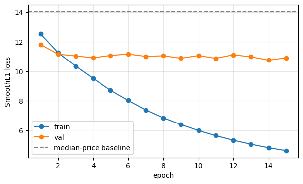
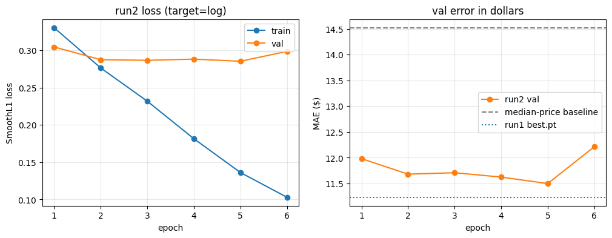

# Experiments

One row per training run. Val numbers only — the test split is not touched
until Phase 3.

Runs are compared on **val MAE in dollars**, scored by `model/evaluate.py`
on the same 11,028 val images. The loss can't be compared across runs once
the target changes (run2's loss is in log-dollars).

| Run | Date | Change from previous | Epochs | best.pt | Val MAE ($) | Val loss | Notes |
|---|---|---|---|---|---|---|---|
| median price | — | always predict $14.00 | — | — | 14.52 | 14.03 | the bar to beat |
| **run1** | 2026-10-01 | — (first full run) | 15 | epoch 14, by val loss | **11.23** | 10.755 | **kept.** Plateaued by epoch ~4, train kept falling |
| run2 | 2026-10-01 | target = log(price) | 6 | epoch 5, by val MAE | 11.50 | 0.285 (log) | no better than run1; plateaued by epoch 2, worse at 6 |

**Current model: run1** (`best.pt`, epoch 14) — val MAE $11.23, median
absolute error $5.71, vs $14.52 / $8.65 for always guessing the median.

---

## run1 — baseline ConvNeXt-Tiny

**Setup:** `convnext_tiny.fb_in22k_ft_in1k` (ImageNet-22k pretrained), single
linear head, SmoothL1 loss on raw price, AdamW lr 1e-4 (constant, no
schedule), batch 64, 15 epochs, 224×224 letterboxed images, augmentation =
RandomResizedCrop(0.8–1.0) + horizontal flip + colour jitter. Kaggle T4,
~15 min/epoch, ~3.8 h total.

**Files:** [`run1_history.json`](experiments/run1_history.json),
[`run1_loss_curve.png`](experiments/run1_loss_curve.png). Checkpoint is
`best.pt` (epoch 14), kept on Kaggle as the `amazon-price-run1` dataset —
too large for git.

**What the curve shows**

- The model clearly learns from the images: val loss is 15.8% below the
  baseline after epoch 1 and 23.4% below at best (10.755). Measured later
  with `model/evaluate.py`: **val MAE $11.23** vs $14.52 for the baseline
  (23% lower), median absolute error $5.71 vs $8.65 (34% lower).
- **Val stopped improving around epoch 4.** From epoch 4 to 15 it moves
  between 10.75 and 11.17 (mean 10.99, sd 0.12) with no trend.
- **Train loss kept falling** from 12.5 to 4.6. By epoch 15 val loss is 2.4×
  train loss: the extra epochs went into memorising the training set, not
  into anything that carries over to new images. Val didn't get worse,
  though, so `best.pt` is still a sound checkpoint.
- **"Best = epoch 14" is mostly noise.** Epoch 14 (10.755) beats epoch 4
  (10.917) by 0.16, which is about one standard deviation of the
  epoch-to-epoch wobble. Picking the lowest of 15 noisy val scores also
  flatters the number slightly — one reason the final figure has to come
  from the untouched test split.

**What it suggests for the next run** (change one thing at a time):

1. Epochs: 5–6 is enough to compare ideas, ~1.5 h each instead of ~4 h.
2. Regularisation, since the problem is memorisation: stochastic depth
   (`drop_path_rate`), stronger augmentation, or more weight decay.
3. Predict log(price) instead of price. Prices run from $1.32 to $145 with a
   long tail; raw-price loss is dominated by expensive items. Comparing this
   fairly needs val MAE in dollars, not the loss value.
4. A learning-rate schedule (warmup + cosine decay) instead of a constant
   1e-4.

**Limitation worth stating:** price is only partly visible in a photo — two
near-identical items can differ a lot in price (brand, pack size, quantity).
Some of the remaining error is a ceiling of image-only prediction, not just
the model.

---

## run2 — log-price target

*The plan and decision rule below were written before the run and are left
as they were. Results follow under "Result".*

**The one change from run1:** the head predicts log(price) instead of price
(`--target log`, see [`model/targets.py`](../model/targets.py)); dollars are
exp(output). Same backbone, loss function (SmoothL1, beta=1, now on
log-price), optimizer, learning rate, batch size, augmentation and data.

On the log scale an error is a ratio: guessing $4 for a $2 item and $100 for
a $50 item are both "2× too high" and cost the same. On run1's raw scale the
second is a 25 times bigger error ($50 vs $2), so the loss is dominated by
expensive items.

**Two other differences, neither of which favours run2:**

- **6 epochs instead of 15.** run1's val error stopped improving by about
  epoch 4, so epochs 7–15 bought nothing. If anything, fewer epochs make
  this a harder test for run2.
- **best.pt is picked by val MAE in dollars** (`--select-by val_mae`) instead
  of val loss. For run1 those are nearly the same thing (SmoothL1 in dollars
  is about MAE − 0.5); for a log-target run they aren't, and dollars is what
  the runs are compared on.

**Decision rule, written down before the run:**

- Deciding number: val MAE in dollars of each run's `best.pt`, both scored
  by `model/evaluate.py` on the same 11,028 val images (notebook Cells 4
  and 7).
- run2 replaces run1 only if its val MAE is lower **and** the paired
  bootstrap 95% interval for the difference excludes 0. Otherwise run1
  stays.
- SMAPE, RMSE, bias and the per-price-range table are reported alongside
  but don't decide.
- Either way, the result goes in this file.

**Expectation going in (not a result):** log-price should help cheap items
and relative error (SMAPE) most. Dollar MAE could go either way, since
expensive items dominate it. A log model also tends to guess low on
average (bias below 0), because exp of an average log is below the average
price.

### Result

**Files:** [`run2_history.json`](experiments/run2_history.json),
[`run2_loss_curve.png`](experiments/run2_loss_curve.png), full evaluation
output in [`run2_vs_run1_val.md`](experiments/run2_vs_run1_val.md). Kaggle
T4, 6 epochs, ~15 min each.

**By the decision rule, run1 stays.** run2's val MAE is $11.50 against
run1's $11.23. The difference is +$0.27, with a 95% interval of +$0.13 to
+$0.40, entirely above 0. SMAPE agrees: 54.9% vs 53.5%, interval also above
0.

The evaluation is consistent with training: `evaluate.py` scored run2's
`best.pt` at $11.498, the same as the val MAE the training loop logged for
epoch 5.

**What the target change did:** it moved error from cheap items to
expensive ones rather than reducing it.

| Price range | run1 MAE | run2 MAE | change |
|---|---|---|---|
| $0-5 | 5.89 | 5.42 | -0.47 |
| $5-10 | 5.06 | 4.85 | -0.21 |
| $10-20 | 6.01 | 5.94 | -0.07 |
| $20-50 | 13.11 | 14.04 | +0.93 |
| $50+ | 42.15 | 43.81 | +1.66 |

Against the expectation written beforehand: cheap items did improve, and the
model did guess lower on average (bias -$4.97 vs -$4.35). SMAPE did **not**
improve; the losses on $20+ items outweighed the gains on cheap ones.

**The curve:**

- Val error stopped improving after epoch 2. Epochs 2-5 sit between $11.50
  and $11.71, then epoch 6 jumps to $12.21, the biggest move of the run,
  with val loss rising too (+4.6%). That looks like overfitting starting,
  though one epoch can't prove it.
- Train error kept falling, from $12.68 to $7.29. run2 fit the training
  images faster than run1 did: run1's train error at epoch 6 was at least
  $8.03 (its loss, a lower bound on MAE).
- More epochs would not have rescued run2: it had already stopped improving
  and was getting worse.
- At matched epochs the two runs were close. run1's per-epoch dollar error
  can be bounded from its logged loss (SmoothL1 with beta=1 is between MAE
  and MAE − 0.5); calibrated on epoch 14, it was about $11.4-11.6 at epochs
  4-6, while run2 was $11.50-11.71. So the honest reading is **log-price
  made no improvement**, rather than "log-price is clearly worse".

**What the plan got wrong:** the rationale said run1's loss was "dominated
by expensive items". That's true of the loss *value*, not of training.
SmoothL1's gradient is capped at the same size for every item whose error is
above $1, and almost every error was, so expensive items never pulled harder
on the weights than cheap ones. The imbalance log-price was meant to fix was
mostly not there.

**What both runs show:**

1. **Memorising, fast.** Val error stops improving within 2-4 epochs while
   train error keeps falling. More epochs don't help either target.
2. **Guesses pulled toward the middle.** In run2, $0-5 items are
   over-predicted by $5.29 on average (almost all of their $5.42 error) and
   $50+ items under-predicted by $42.24 (almost all of their $43.81). The
   model can't reliably tell cheap or expensive items from mid-priced ones
   by the photo, so it hedges toward typical prices. It's also why the
   always-$14 baseline beats both models on $10-20 items: $14 is
   automatically close for those.

Point 2 is the bigger limit. It fits the limitation noted under run1: pack
size, quantity and brand drive price but are hard to see in a photo, and no
target change can recover information the image doesn't carry.
